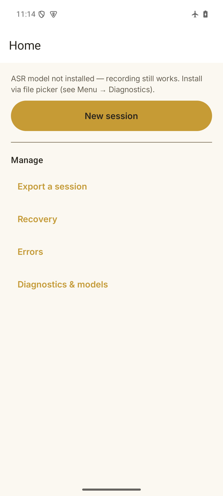

# scrappy — Offline-First Classroom Capture

[](https://github.com/ganeshgawali2007-arch/Scrappy_DataCollector/actions/workflows/ci.yml)
[](https://github.com/ganeshgawali2007-arch/Scrappy_DataCollector/releases)
[](LICENSE)
[](https://kotlinlang.org)
[](https://developer.android.com/jetpack/compose)
[](https://developer.android.com/studio/releases/gradle-plugin)
[](https://android.com)
[](https://developer.android.com/ndk/guides/abis)

Offline-first Android app (Kotlin + Jetpack Compose) that records classroom speech in **Hindi, English, and Marathi**, persists every raw artifact, runs local ASR (whisper.cpp) and optional local LLM annotation (llama.cpp), and exports a verified dataset ZIP for Mac review.

**Display name:** `scrappy` (lowercase) — Package: `com.scraper.classroomcapture`

---

## 🎯 Why scrappy?

Classroom speech datasets are critical for low-resource language ASR, translation, and TTS — but existing tools require cloud connectivity, lose raw audio, or lack pedagogical metadata. scrappy solves this:

| Problem | scrappy's approach |
|---------|-------------------|
| **Cloud dependency** | 100% offline — no `INTERNET` permission, CI-enforced |
| **Lost raw audio** | Immutable artifacts: WAV + ASR + LLM + events + checksums, never overwritten |
| **No pedagogical context** | Exports `pedagogical_sample.v2` with grade, subject, activity, concept stage, evidence spans |
| **Model lock-in** | User installs models via file picker (USB/Mac); APK never bundles weights |
| **Unreliable processing** | Durable queue: lease/heartbeat, retry with backoff, idempotent workers, crash-safe |

---

## ✨ Features

| Module | Capability |
|--------|------------|
| **🎙️ Capture** | Foreground mic service, 16 kHz mono PCM16 WAV, manual segmentation, lock/background/rotation survival |
| **🗄️ Durability** | Room metadata + atomic artifact store (tmp+fsync+rename), startup reconciliation, quarantine (no silent deletion) |
| **⚙️ Processing** | Durable queue with lease/heartbeat, exponential backoff retry, idempotent workers, crash-safe |
| **🤖 ASR** | whisper.cpp seam, `ModelRegistry` (user-installed via file picker), hi/en/mr fixtures |
| **🧠 LLM (optional)** | llama.cpp seam, GGUF registry, strict JSON validation, evidence spans, `AI_SUGGESTION` label |
| **📦 Export** | SAF streaming, `manifest.v2.json + records.jsonl + audio/asr/annotation + events + checksums`, temp build + reopen-ZIP verification |
| **🔧 Recovery** | Resumable session, error/retry UI, no data loss |

---

## 📱 Screenshots

| Home | New Session | Recording | Summary | Export |
|------|-------------|-----------|---------|--------|
|  |  |  |  |  |

*Screenshots in `docs/screenshots/` (add your own)*

---

## 🚀 Quick Start

### Prerequisites
- macOS (Apple Silicon) with Homebrew, or Linux
- Android device (API 29+, arm64-v8a) or emulator
- JDK 17, Android SDK (cmdline-tools), NDK r27c, CMake 3.22.1

### Build & Install (Debug)
```bash
# One-time: set up toolchain
export JAVA_HOME=/opt/homebrew/opt/openjdk@17/libexec/openjdk.jdk/Contents/Home
export ANDROID_HOME=/opt/homebrew/share/android-commandlinetools

# Build debug APK
./gradlew assembleDebug

# Install
adb install -r app/build/outputs/apk/debug/app-debug.apk
```

### Build Release (Signed, Minified)
```bash
# 1. Configure signing (never commit keystore.properties!)
cp keystore.properties.example keystore.properties
# Edit keystore.properties with your store/key passwords

# 2. Build signed release APK
./gradlew assembleRelease
# Output: app/build/outputs/apk/release/app-release.apk
# (v2 signed, R8 minified, ~2.9 MB arm64-v8a)
```

### Verify Quality Gates
```bash
./gradlew testDebugUnitTest ktlintCheck lintDebug
# ✅ 107 tests pass
# ✅ ktlint clean (all source sets)
# ✅ lint clean (all translations)
```

---

## 🤖 Model Installation (Required for ASR/LLM)

Models are **never bundled** in the APK. No network access ever.

1. On first launch, app shows "ASR model not installed" banner
2. Go to **Menu → Diagnostics → Install model**
3. Pick a `.bin` (whisper.cpp) or `.gguf` (llama.cpp) file from local storage (USB/Mac transfer)
4. App verifies SHA-256, installs to private storage
5. Recording/export work **without** models; transcription/annotation need them

### Recommended Models (evaluate on target device)
| Task | Candidate | Source |
|------|-----------|--------|
| ASR | `tiny` / `base` / `small` multilingual | OpenAI Whisper via whisper.cpp (MIT) |
| LLM | GGUF quantized `small`/`medium` | llama.cpp (MIT) |

> Record per-model SHA-256, license, and benchmark (WER/CER, RTF, RAM, thermal) in `FIELD_DEPLOYMENT.md` before deployment.

---

## 📦 Export Format (Verified Dataset)

```
export.zip/
├── manifest.v2.json          # export_id, record_count, files[], records_sha256, VERIFIED
├── records.jsonl             # pedagogical_sample.v2 (one per sample)
├── records/<id>.v2.json      # per-sample JSON
├── audio/<id>.wav            # 16 kHz mono PCM16
├── asr/<id>.v1.json          # when transcribed
├── annotation/<id>.v1.json   # when annotated (AI_SUGGESTION)
├── events.jsonl              # device_event.v1 (diagnostics only, no content)
├── models.json               # observed model identities (asr:..., llm:...)
├── translation_pairs.v1.jsonl # empty in v0 (no human-verified gold)
├── tts_pairs.v1.jsonl        # empty in v0
└── pedagogy_eval.v1.jsonl    # empty in v0
```

**Verification:** Temp build → reopen ZIP → validate every entry/checksum/count/schema → stream to SAF destination → `VERIFIED` (or `WRITTEN_UNVERIFIED` if provider can't read back)

**Source recordings never auto-deleted.** Re-export creates new `ExportRecord`.

---

## 🏗️ Architecture

```
app/src/main/java/com/scraper/classroomcapture/
├── audio/              # AudioRecord, WAV writer, device routing, meter
├── recording/          # Foreground service, controller, notification
├── data/               # Room entities, DAOs, repositories, serialization
├── storage/            # ArtifactStore (atomic tmp+fsync+rename, SHA-256)
├── processing/         # Durable queue, dispatcher, retry policy
├── asr/                # WhisperAsrEngine, ModelRegistry, WavValidator
├── llm/                # LocalLlmEngine, GgufRegistry, PromptTemplate
├── export/             # ExportBuilder, ExportManager, preflight
├── ui/                 # Compose screens, ViewModels, navigation
├── diagnostics/        # Logs, benchmark, debug
└── di/                 # Manual DI container (AppContainer)

docs/                   # ARCHITECTURE, DATA_SCHEMA, EXPORT_FORMAT, LOCAL_LLM, MODEL_LICENSES
schemas/                # JSON schemas (pedagogical_sample.v2, etc.)
keystore.properties.example  # Release signing template
```

### Key Invariants (from `plan.md`)
1. **Capture independent of inference** — recording never waits for ASR/LLM
2. **Raw evidence immutable** — audio, transcripts, model outputs never overwritten
3. **Durable before processing** — sample queued only after WAV fsynced + checksum + metadata committed
4. **Derived data optional** — missing ASR/LLM never blocks export
5. **Every transition auditable** — state, attempts, errors, timestamps, app/model versions
6. **Technically offline** — production manifest has **no `INTERNET` permission** (CI enforced)

---

## 🛠️ Tech Stack

| Layer | Technology |
|-------|------------|
| **Language** | Kotlin 2.0 |
| **UI** | Jetpack Compose (Material3), Navigation Compose |
| **Architecture** | Manual DI, ViewModels, Repository pattern, Flow |
| **Database** | Room (SQLite), explicit migrations, no destructive fallback |
| **Serialization** | kotlinx.serialization (JSON, snake_case wire names) |
| **ASR** | whisper.cpp (JNI), ModelRegistry (file picker + SHA-256) |
| **LLM** | llama.cpp (JNI), GGUF registry, strict JSON validation |
| **Build** | Gradle 8.9 (Kotlin DSL), AGP 8.7.3, R8 minify + shrink |
| **Native** | NDK r27c, CMake 3.22.1, arm64-v8a (release) |
| **Quality** | ktlint, Android Lint, JUnit4, 107 unit tests |

---

## 📚 Documentation

| Document | Description |
|----------|-------------|
| `plan.md` | Implementation plan with invariants & gates |
| `todos.md` | Execution checklist with verification evidence |
| `DECISIONS.md` | Pinned product/architecture/model decisions |
| `docs/ARCHITECTURE.md` | System overview |
| `docs/DATA_SCHEMA.md` | `pedagogical_sample.v2` canonical record |
| `docs/EXPORT_FORMAT.md` | ZIP layout & verification |
| `docs/LOCAL_LLM.md` | LLM annotation design |
| `docs/MODEL_LICENSES.md` | whisper.cpp/llama.cpp licenses & provenance |

---

## 🔐 Release & Signing

```bash
# 1. Generate release keystore (once, keep forever!)
keytool -genkeypair -v -keystore keystore/scrappy-release.jks \
  -alias scrappy -keyalg RSA -keysize 4096 -validity 10000 \
  -storetype PKCS12

# 2. Create keystore.properties (gitignored)
# storeFile=keystore/scrappy-release.jks
# storePassword=***
# keyAlias=scrappy
# keyPassword=***

# 3. Build release
./gradlew assembleRelease
```

**⚠️ CRITICAL:** Back up `keystore/scrappy-release.jks` and `keystore.properties` securely. **Losing them = cannot update the app.**

---

## 📋 Release Checklist (P13)

- [ ] Keystore backed up securely
- [ ] Version bumped in `app/build.gradle.kts` (`versionCode`, `versionName`)
- [ ] `./gradlew assembleRelease` → APK verified with `apksigner`
- [ ] Test on target device (API 29+, arm64-v8a): airplane mode, full capture→export flow
- [ ] `FIELD_DEPLOYMENT.md` updated with soak results
- [ ] GitHub Release created with APK + changelog

---

## 🤝 Contributing

This is an internal research tool. For questions or issues, open a GitHub Issue.

---

## 📄 License

**Proprietary — internal use only.**

Native dependencies have separate licenses:
- **whisper.cpp** — MIT (code), OpenAI Whisper model weights — MIT-compatible
- **llama.cpp** — MIT (code), GGUF weights — vary by model

See `docs/MODEL_LICENSES.md` for full provenance.

---

## 🙏 Acknowledgments

- [ggerganov/whisper.cpp](https://github.com/ggerganov/whisper.cpp) — MIT
- [ggerganov/llama.cpp](https://github.com/ggerganov/llama.cpp) — MIT
- OpenAI Whisper — MIT
- Android Jetpack Compose — Apache 2.0
- Room, kotlinx.serialization — Apache 2.0